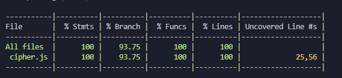

# "Alértame Cesar" 💉

## Definición Del Producto📖

### Contexto y Objetivo

Chile  según el informe de OnuSida conocido el año pasado se convirtió en uno de los diez países donde más han aumentado los casos de VIH, posicionándolo a la par de países como Egipto, Madagascar, Macedonia, Filipinas, entre otros.
Por esto es imprescindible crear un servicio adicional para la  Clínica Angelus."Alértame Cesar" es una aplicación web orientada al cifrado y descifrado de información de carácter clínico, específicamente en la toma de muestras de sangre para el examen de VIH, ayuda a que el resultado sea lo  más expedito posible generando que las usuarios se lo realicen con más  frecuencia, ya que  gracias a este servicio se optimiza el tiempo,  se genera confiabilidad  y la vez refuerza las estrategias de prevención y diagnóstico en la materia.

El objetivo de esta aplicación web es poder enviar un identificador único  a la persona que se realizó al examen, a través de un mensaje de texto  o correo electrónico de los resultados, y a la vez permite descifrar para solicitar día, hora y fecha de examen manteniendo la identidad resguardada en todo momento.

### Usuarios
Está orientada para personas a partir de los 15 años que puedan realizarse el examen de VIH.

### Metodología Utilizada - Cifrado César
El cifrado césar es una de las técnicas más simples para cifrar un mensaje. Es un tipo de cifrado por sustitución, es decir que cada letra del texto original es reemplazada por otra que se encuentra un número fijo de posiciones (desplazamiento) más adelante en el mismo alfabeto.

Por ejemplo, si usamos un desplazamiento de 3 posiciones:
La letra A se cifra como D.
La palabra CASA se cifra como FDVD.
Alfabeto sin cifrar: A B C D E F G H I J K L M N O P Q R S T U V W X Y Z
Alfabeto cifrado: D E F G H I J K L M N O P Q R S T U V W X Y Z A B C

## Diseño Experiencia Usuario⚙️  ️

### Control de Flujo y Sketching

  

Se realizó un prototipo que fue mostrado a  diferentes usuarios,  donde se generó principalmente la idea de que fuera un espacio de fácil entendimiento y de simpleza visual.

 

 

Los testeos con posibles usuarios fueron de vital importancia, ya que gracias a sus opiniones se hicieron mejoras, cómo la eliminación de un prompt para el ingreso de su nombre  y modificaciones en el contenido como en el caso de las instrucciones, ya que estas no resultaban útiles porque  los usuarios no las leían.

Los colores fueron sacados siguiendo el patrón del logo, pero no obstante realice un estudio de mercado de las  páginas web de las clínicas Chilenas  para poder sacar una paleta de colores acorde, los colores que más  predominaban era el color blanco y gris, por lo cual lo tome como colores referenciales. La elección de letra se tomó una que sean sobrias, dieran confiabilidad  y seriedad. Los botones  siguen el patrón de la paleta de colores.

## Ejecutar Aplicación
Para ejecutar la aplicación se debe ingresar haciendo clic en el siguiente enlace:
https://alejandramoralesb.github.io/SCL010-Cipher/src/

## Interfaz de usuario.

El modo de uso de " Alértame Cesar" permite a los usuarios:

1- ***Ingresar a la aplicación web.***

2- ***Indicar el identificador único asignado como paciente.*** (Este número será dado en la clínica, para nuevos usuarios será 1, esto indicara cuántas posiciones de desplazamiento se producirá en cada carácter)

3- ***Insertar un mensaje y aplicar según necesidad:***
  *Cifrado: Escribir identificador único que  será enviado por mensaje de texto o por via correo electronico.*
  *Descifrado: Escribir para solicitar hora, escribiendo iniciales, día, mes y hora estimativa Ej.: AM 24/06 8:30AM.*

4- ***Ver el resultado del mensaje cifrado/descifrado.***
*Cifrado: Resultados del Examen.*
*Descifrado: Copiar y enviar al correo o al teléfono señalado, esperar confirmacion.*

5- ***Limpiar o Volver al Inicio, según lo que requiera el usuario.***

- Limitaciones: no permite la Ñ, símbolos y números negativos.

## Interfaz de programador. 
Los Pasos generales  y específicos en la creación de la aplicación web se realizó con un To-Do List en Trellos, dando estructura y funcionalidad a medida que pasaban los días.

Además se realizaron test para probar el funcionamiento de la aplicación web, alcanzando los siguientes resultados:

 

## Archivos. 🛠️

* `README.md`: como ejecutar la aplicación, introducción, aplicación, su funcionalidad y decisiones de diseño que tomaron.

* `src/index.html`:Punto de entrada a la aplicación.

* `src/cipher.js`: implementación  del objeto cipher. Este objeto (`cipher`) debe contener dos métodos:

- `cipher.encode(offset, string)`: `offset` es el número de posiciones que queremos mover a la derecha en el alfabeto y `string` el mensaje (texto) que queremos cifrar.
- `cipher.decode(offset, string)`: `offset` es el número de posiciones que queremos mover a la izquierda en el alfabeto y `string` el mensaje (texto) que queremos descifrar.

* `src/index.js`: eventos del DOM,  `cipher.encode()`o `cipher.decode()` según sea necesidad del usuario.

* `test/cipher.spec.js`: implementación para los test  `cipher.encode()` y `cipher.decode()`.

###Parte Opcional
Puesto que el objetivo del proyecto, era cifrar y descifrar mayúsculas, como parte del hacker edition se incluyo las minúsculas, números  y el "espacio", generando más opciones al usuario.

## Autor ✒️
***Alejandra Morales Barra ***😊 -- [Estudiante 10° generación SCL ](https://github.com/AlejandraMoralesB)
